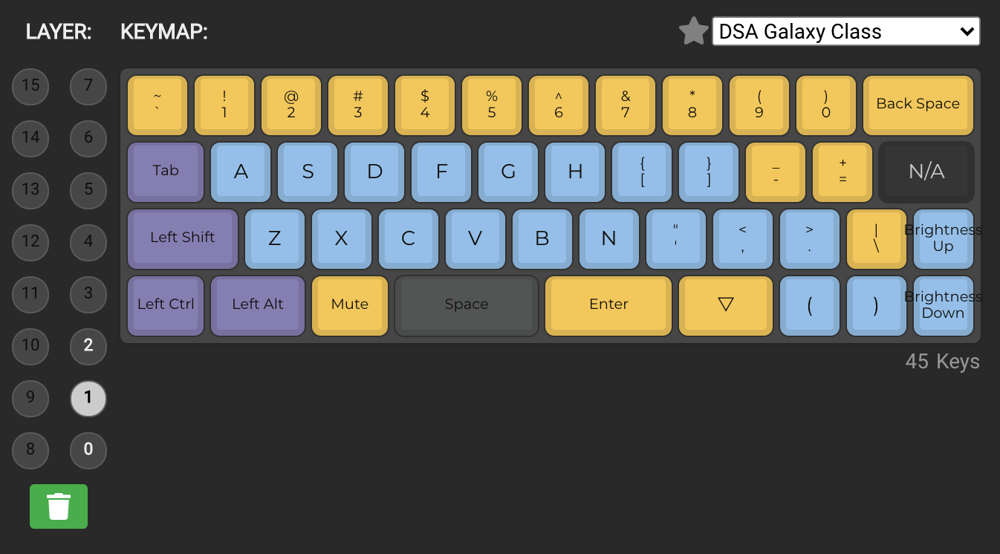
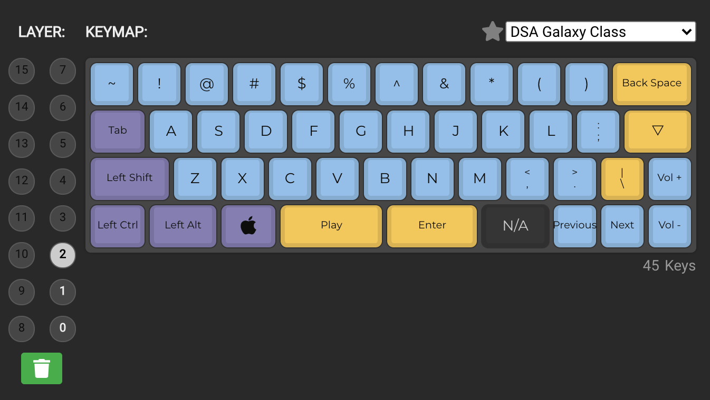

# How to set up the minivan keyboard

1. Use `keymap_oppermax.json` as input for the [qmk configurator](https://config.qmk.fm/)
2. Configure more if needed, compile and download firmware
3. Use the [qmk toolbox](https://github.com/qmk/qmk_toolbox) to flash the new firmware on the keyboard

See the following screenshots as reference for the current configuration:

